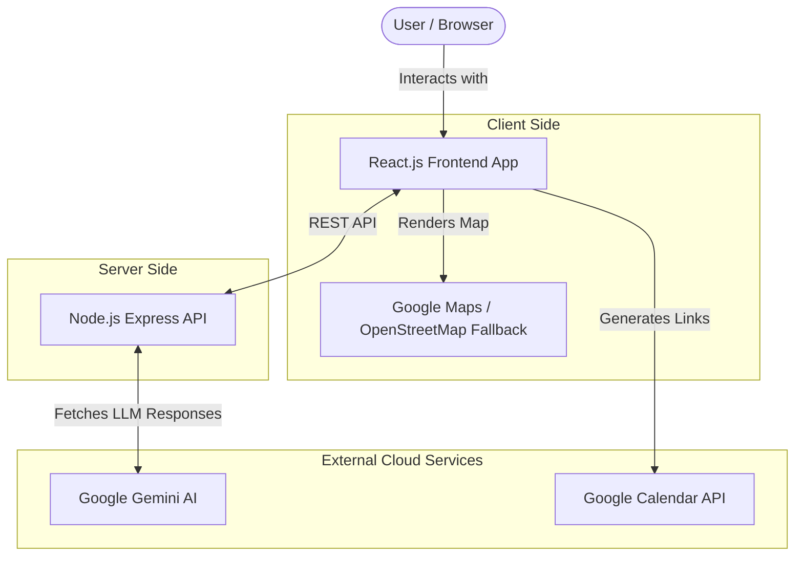

# 🇮🇳 India Election Smart Assistant

## 1. Project Overview
India Election Smart Assistant is an AI-powered, highly interactive web application designed to help Indian citizens understand and complete the entire election process. It acts as a personalized, step-by-step guide, answering questions, providing official ECI guidelines, and helping users navigate the complexities of voter registration, eligibility, and polling locations. 

With features like AI-powered chat, interactive maps, and calendar syncing, this app aims to make participating in the world's largest democracy easy and accessible for everyone.

## 2. Architecture Diagram



## 3. Solution Approach
The **India Election Smart Assistant** provides a unified, conversational interface powered by Google Gemini. It personalizes the experience based on user demographics (Age, State, First-time voter status) and provides step-by-step guidance. Integrations with maps and calendar enhance usability by making it easy to find polling stations and remember key dates.

## 4. Google Services Integration
- **Google Gemini API**: Powers the conversational assistant to answer election queries intelligently.
- **Google Maps API**: Provides the "Polling Booth Locator". Gracefully falls back to OpenStreetMap if keys are not provided.
- **Google Calendar API**: Enables users to add important election events (registration deadlines, voting days) directly to their calendars.

## 5. Features
- **🤖 AI Conversational Assistant**: Natural language chat with Gemini.
- **🧠 Smart Personalization Engine**: Customized eligibility and timeline based on user details.
- **🗺️ Polling Booth Locator**: Find nearby stations using maps.
- **📅 Calendar Integration**: Add election events to Google Calendar.
- **🪜 Step-by-Step Guide**: Interactive checklist for the voting process.

## 6. How to run locally
1. Clone the repository.
2. Setup the **Backend**:
   ```bash
   cd backend
   npm install
   cp .env.example .env # Update with your API keys
   npm start
   ```
3. Setup the **Frontend**:
   ```bash
   cd frontend
   npm install
   cp .env.example .env # Update with your API keys
   npm start
   ```

## 7. How to Deploy to Google Cloud Run
The application has been configured to serve both the frontend and backend as a single service using Docker.
1. Download the code or clone the repository.
2. Open Google Cloud Shell in your Google Cloud Console.
3. Upload the project and unzip it if necessary.
4. Run the deployment command:
   ```bash
   gcloud run deploy india-election-smart-assistant --source . --region us-central1 --allow-unauthenticated
   ```
